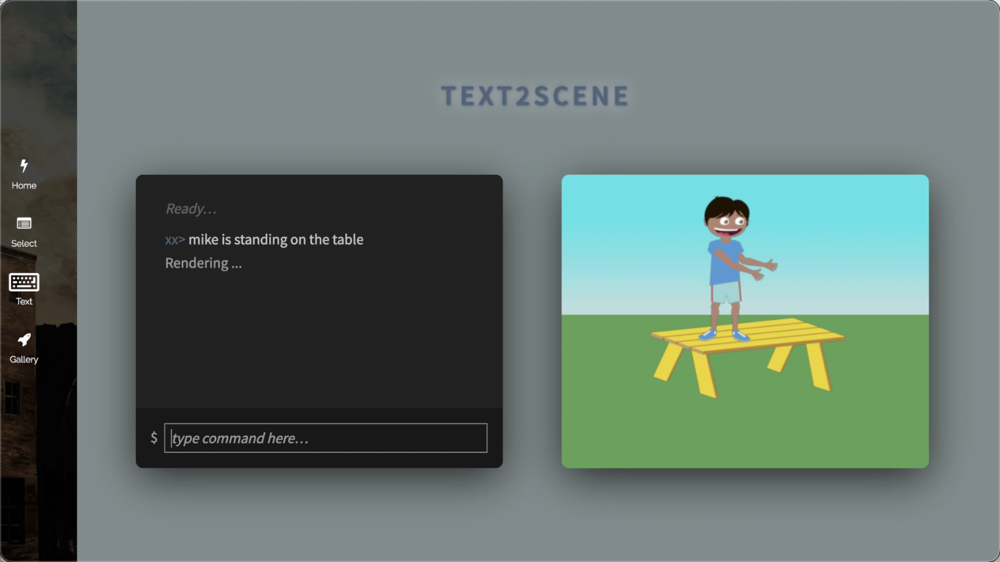

# Text2Cartoon-FrontEnd

This is front end of text to cartoon.

User enters a piece of English description text on the left, and a cartoon scene picture corresponding to the text will be generated on the right.

Cartoon scene pictures consist of characters, objects, and relationships between characters and objects.

## Video
